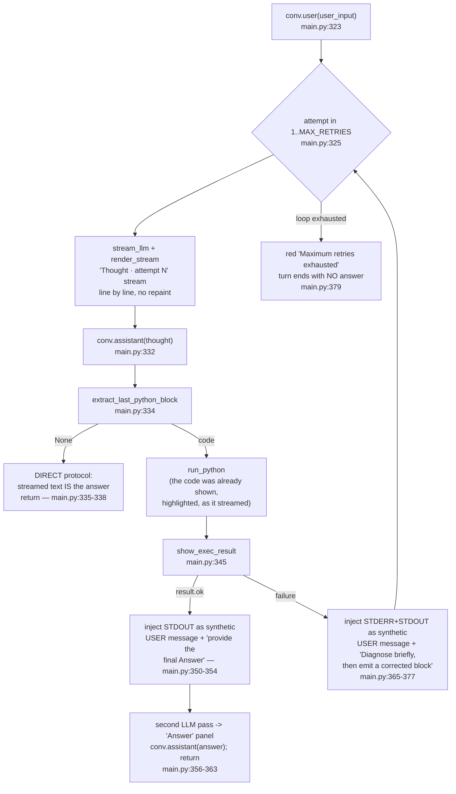
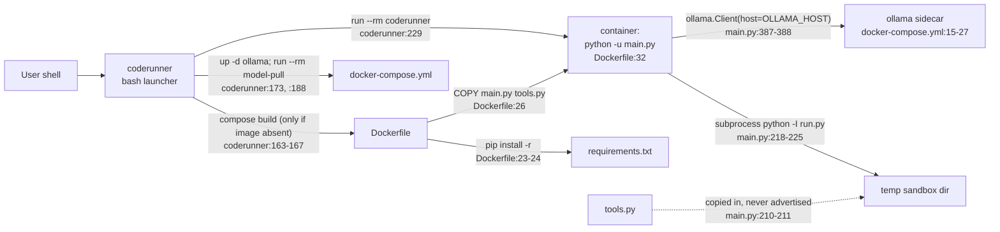

# CodeRunner.AI — Project Structure

> Scope note: `.claude/` and `.moai/` are AI-agent tooling committed alongside
> the product. `CLAUDE.md` is agent-orchestration configuration. Neither is part
> of CodeRunner.AI and neither is read, imported, or shipped by any product file.

---

## 1. Repository tree

```
CodeRunner.AI/
├── coderunner                  # PRODUCT · bash launcher (executable, 229 lines)
├── main.py                     # PRODUCT · application, single module (512 lines)
├── tools.py                    # PRODUCT · sandbox-importable helper (99 lines)
├── Dockerfile                  # PRODUCT · runtime image (32 lines)
├── docker-compose.yml          # PRODUCT · 3-service stack (66 lines)
├── requirements.txt            # PRODUCT · 6 pinned-by-floor deps (6 lines)
├── README.md                   # PRODUCT · user-facing docs (115 lines)
├── LICENSE                     # PRODUCT · Apache License 2.0 (201 lines)
├── .gitignore                  # repo hygiene (MoAI-supplied template)
│
├── .claude/                    # TOOLING — not product
│   ├── agents/moai/            #   agent definitions
│   ├── commands/moai/          #   slash commands
│   ├── hooks/moai/             #   lifecycle hooks
│   ├── skills/                 #   skill packs
│   ├── output-styles/moai/
│   └── settings.json
├── .moai/                      # TOOLING — not product
│   ├── config/                 #   project/user/language config
│   ├── announcements/
│   ├── llm-configs/
│   └── project/                #   <- these generated documents
├── CLAUDE.md                   # TOOLING — agent orchestration directive
├── .mcp.json                   # TOOLING — MCP server config
└── .cursorrules                # TOOLING — untracked editor rules
```

Verified absent from the repository:

| Path | Status |
| --- | --- |
| `tests/` | does not exist |
| `conftest.py` | does not exist |
| `pyproject.toml` | does not exist |
| `setup.py`, `setup.cfg` | do not exist |
| `.dockerignore` | does not exist |
| `.github/` | does not exist |
| any lockfile (`*.lock`) | does not exist |

The only `test_*.py` file anywhere in the tree is
`.claude/hooks/moai/lib/test_hooks_improvements.py`, which belongs to the MoAI
tooling, not to the product.

**There are zero tests for `main.py` and `tools.py`.** See Section 6.

---

## 2. Product files

| File | Lines | Purpose |
| --- | ---: | --- |
| `coderunner` | 229 | Bash launcher. Installs and starts Docker, detects compose, builds the image on first run, brings up the Ollama sidecar and pulls the model, installs a cleanup trap, runs the app container ephemerally, and implements `--doctor`. Strict mode `set -Eeuo pipefail` at `coderunner:10`; `cd`s to its own directory at `coderunner:12-13`. |
| `main.py` | 512 | The entire application: configuration, system prompt, conversation model, LLM streaming, code extraction, subprocess executor, Rich renderers, the agentic loop, and the REPL. Container entry point per `Dockerfile:32`. |
| `tools.py` | 99 | Stdlib-only `web_search()` helper intended for import by generated scripts. Copied into each sandbox by `main.py:210-211`. Currently unreachable — see Section 5.3. |
| `Dockerfile` | 32 | Single-stage `python:3.11-slim` image. Installs `ca-certificates`, then requirements, then source; creates and switches to the non-root `runner` user. |
| `docker-compose.yml` | 66 | Three services (`ollama`, `model-pull`, `coderunner`) plus the named volume `coderunner_ollama_data`. |
| `requirements.txt` | 6 | `rich`, `ollama`, `httpx`, `requests`, `beautifulsoup4`, `lxml` — all `>=` lower bounds only. |
| `README.md` | 115 | Quickstart, env-var table, annotated sample session, "How it works", file index, license pointer. |
| `LICENSE` | 201 | Apache License 2.0 (`LICENSE:1-3`). |

Total product source: **1,260 lines** across the eight files above.

---

## 3. Module organization of `main.py`

`main.py` is a single flat, procedural module. It defines two dataclasses and
eighteen module-level functions; there are no classes with behavior, no
packages, no dependency injection, and no plugin surface. The file is divided by
banner comments:

| Section (banner) | Lines | Contents |
| --- | --- | --- |
| File header | 1-17 | ASCII logo, project/description/author/license, runtime note `Python 3.11+ \| Docker-only (ephemeral, --rm)` (`main.py:16`) |
| Imports | 19-44 | `from __future__ import annotations` (`:19`); stdlib incl. `readline` (`:24`), `subprocess` (`:27`), `tempfile` (`:29`); third-party `httpx` (`:35`), `ollama` (`:36`), seven `rich` imports (`:37-44`) |
| **Configuration** | 47-60 | Five environment-derived constants (`:51-55`), `HISTORY_MAX = 1000` (`:56`), `TOOLS_MODULE` path (`:58`), the `console` singleton (`:60`) |
| `SYSTEM_PROMPT` | 63-114 | The full agent contract: CODE vs DIRECT protocol selection (`:67-70`), CODE rules and library list (`:72-99`), DIRECT rules (`:101-106`), post-execution answer instruction (`:108-109`), failure-diagnosis instruction (`:111-112`) |
| **Data model** | 117-133 | `@dataclass Conversation` with `messages: list[dict]` and the `system()` / `user()` / `assistant()` appenders (`:122-133`) |
| **LLM streaming** | 136-163 | `stream_llm()` — yields content deltas from `client.chat(..., stream=True)` (`:141-146`); `render_stream()` — prints each COMPLETED line once and never repaints it, keeping only the unfinished tail in a `Live` at `refresh_per_second=12`; renders inline markdown per line and, with `highlight_code=True`, numbers and highlights fenced code behind a solid rail. Helpers: `_render_markdown_line()`, `_render_code_line()`, `_style_line()`, `_emit_line()` |
| **Code extraction & execution** | 166-242 | `CODE_BLOCK_RE` (`:171`); `extract_last_python_block()` returning the **last** match (`:174-176`); `SCRIPT_HEADER` prepended to every generated script (`:179-188`); `@dataclass ExecResult` with `ok/stdout/stderr/timed_out/returncode` (`:191-197`); `run_python()` (`:200-242`) |
| **Status renderers** | 245-314 | `status()` icon+tag+message line (`:250-255`); `show_exec_result()` green/red panel incl. the TIMEOUT title (`:269-290`); `show_banner()` (`:293-314`) |
| **Agentic loop** | 317-379 | `agentic_turn()` — the whole turn state machine (`:322-379`) |
| **Entry point** | 382-512 | `build_client()` (`:387-388`); `_connection_help_panel()` (`:391-408`); `preflight()` (`:411-420`); `_install_history()` (`:423-450`); `_prompt_user()` (`:453-458`); `repl()` (`:461-495`); `_install_signal_handlers()` (`:498-504`); `if __name__ == "__main__"` guard (`:507-512`) |

### 3.1 Turn control flow — `agentic_turn()` (`main.py:322-379`)



Two structural details worth noting:

- Execution feedback is injected with **`conv.user()`**, not a tool/system role
  (`main.py:354`, `main.py:377`) — the runtime impersonates the user to deliver
  stdout/stderr back to the model.
- A successful execution costs **two** LLM round trips per attempt: one to
  produce the code, one to produce the grounded answer (`main.py:327-331` then
  `main.py:357-361`).

### 3.2 REPL loop — `repl()` (`main.py:461-495`)

`show_banner()` → `_install_history()` → `build_client()` → `preflight()`; on
preflight failure the process exits with status 2 (`main.py:466-467`). A
`Conversation` is created and seeded with `SYSTEM_PROMPT` **once**, outside the
loop (`main.py:469-470`), so context accumulates across all turns of the
session. Each iteration prints a dim `Rule`, reads a line, skips blanks, honors
`/exit` / `/quit` / `:q` (`main.py:483`), and wraps `agentic_turn()` in three
exception handlers: `ollama.ResponseError` (`:488-489`), httpx transport errors
(`:490-491`), and `KeyboardInterrupt` (`:492-493`).

---

## 4. Runtime-generated sandbox layout

`run_python()` (`main.py:200-242`) materializes a throwaway directory for every
single execution:

```
$TMPDIR/coderunner_<random>/        <- tempfile.mkdtemp(prefix="coderunner_")   main.py:201
├── run.py                          <- SCRIPT_HEADER + "\n" + code + "\n"       main.py:202-205
└── tools.py                        <- shutil.copy2 of /app/tools.py,
                                       only if TOOLS_MODULE.exists()            main.py:210-211
```

The subprocess is invoked as
`[sys.executable, "-I", script_path]` with `capture_output=True`, `text=True`,
`timeout=timeout`, `check=False`, and `cwd=workdir` (`main.py:218-225`).

Two consequences documented in the inline comment at `main.py:213-216`:

1. Running `python run.py` prepends the script's own directory to `sys.path`, so
   `from tools import web_search` would resolve without `PYTHONPATH` — which
   matters because `-I` strips `PYTHON*` environment variables anyway.
2. Site-packages (`requests`, `bs4`, `lxml`) remain importable under `-I`;
   isolated mode removes the user site directory and env-var influence, not the
   interpreter's own site-packages.

`shutil.rmtree(workdir, ignore_errors=True)` runs in a `finally` block
(`main.py:241-242`), so the directory is removed on success, on non-zero exit,
on timeout, and on any exception path. Nothing produced by generated code
survives the call — including files the script intended to keep.

---

## 5. Cross-file relationships



### 5.1 Import graph

`main.py` imports no first-party module. `tools.py` is referenced only as a
filesystem path (`TOOLS_MODULE`, `main.py:58`) and copied as data
(`main.py:211`) — it is never imported by the application process.

### 5.2 `tools.py` internal structure

| Symbol | Lines | Role |
| --- | --- | --- |
| `_UA`, `_TIMEOUT` | 18-19 | Fixed User-Agent string and 8-second fetch timeout |
| `_fetch()` | 22-25 | `urllib.request` GET with UA header, UTF-8 decode with `errors="replace"` |
| `_ddg_instant()` | 28-49 | DuckDuckGo Instant Answer JSON API; builds hits from `AbstractText` and `RelatedTopics` |
| `_HTML_RESULT_RE` | 52-56 | Regex over `result__a` / `result__snippet` anchors |
| `_ddg_html()` | 59-75 | HTML-endpoint fallback; unwraps the `uddg` redirect query param, strips tags, unescapes entities, honors `limit` |
| `web_search()` | 78-96 | Public entry: empty-query guard, Instant Answer first, HTML fallback, error dict on total failure |
| `__all__` | 99 | Exports `web_search` only |

### 5.3 The disconnect

`SYSTEM_PROMPT` (`main.py:63-114`) never names `tools.py` or `web_search`; its
library list is "stdlib, requests, beautifulsoup4 (bs4), lxml" (`main.py:83`),
and its search guidance points the model at DuckDuckGo HTML parsed with
BeautifulSoup (`main.py:91-94`) rather than at the shipped helper. The model
cannot discover a module it is never told about, so the copy at `main.py:211` is
a no-op in practice and all 99 lines of `tools.py` are dead. Full discussion in
`product.md` Section 6.1.

---

## 6. Test structure

**There is none.**

- No `tests/` directory, no `conftest.py`, no `test_*.py` or `*_test.py` file
  belonging to the product.
- No test runner configuration of any kind — there is no `pyproject.toml`,
  `setup.cfg`, `pytest.ini`, or `tox.ini` in the repository.
- `.gitignore` nevertheless lists `.pytest_cache/`, `.coverage`,
  `coverage.json`, and `htmlcov/`, so the ignore file anticipates a test suite
  that was never written. (That `.gitignore` is a MoAI-supplied template, which
  explains the mismatch.)

If a suite is added, the highest-value units are the pure and near-pure
functions, none of which need a live model:

| Target | Location | Why it is testable in isolation |
| --- | --- | --- |
| `extract_last_python_block()` | `main.py:174-176` | Pure string in / string-or-`None` out. Cases: no fence, one fence, multiple fences (must return the **last**), ```` ```py ```` and bare ```` ``` ```` variants, leading/trailing whitespace |
| `run_python()` | `main.py:200-242` | Real subprocess, no model needed. Cases: success rc=0 with stdout, non-zero rc with stderr, timeout path (`main.py:233-240`), verification that `workdir` is gone afterwards, presence of `tools.py` in the sandbox |
| `_ddg_instant()` / `_ddg_html()` / `web_search()` | `tools.py:28-96` | Parsing helpers over fixed HTML/JSON fixtures with `_fetch` patched; covers the `uddg` unwrap (`tools.py:66`) and the empty-query guard (`tools.py:85-86`) |
| `Conversation` | `main.py:122-133` | Trivial append semantics and role ordering |
| `ExecResult` construction | `main.py:191-197` | Field-mapping assertions against `subprocess.CompletedProcess` |

Harder to test as currently written, because they are coupled to the global
`console` and to a live `ollama.Client`: `render_stream()` (`main.py:323-`),
`agentic_turn()` (`main.py:322-379`), `repl()` (`main.py:461-495`).
`agentic_turn()` takes its client as a parameter, so it is fake-able, but its
retry bound reads the module-level `MAX_RETRIES` constant (`main.py:54`,
`main.py:325`) rather than an argument, which forces monkeypatching.
