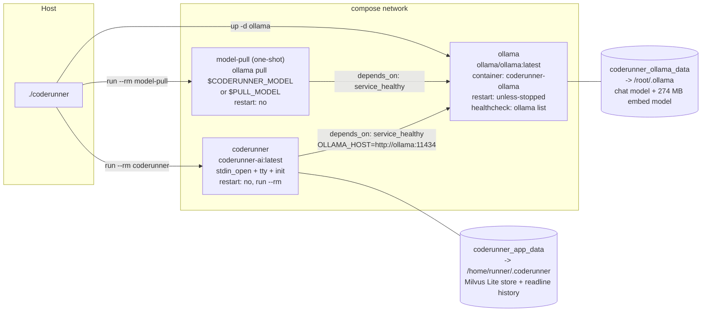

# CodeRunner.AI — Technology Stack

> Scope note: this document covers the product stack only. `.claude/`, `.moai/`,
> `CLAUDE.md`, and `.mcp.json` are AI-agent tooling and are excluded.

---

## 1. Stack at a glance

| Layer | Technology | Evidence |
| --- | --- | --- |
| Language | Python 3.11 | `Dockerfile:9` (`FROM python:3.11-slim AS runtime`); header comment "Runtime : Python 3.11+" at `main.py:16` |
| Launcher | Bash, strict mode | `coderunner:1` shebang, `coderunner:10` `set -Eeuo pipefail` |
| Terminal UI | Rich | `main.py:37-44`; `Console` singleton `main.py:97` |
| LLM transport | `ollama` Python client | `main.py:36`, `main.py:186`, `main.py:550` |
| Inference server | Ollama (containerized sidecar) | `docker-compose.yml:15-27` |
| Default model | `llama3.1:8b` | `main.py:66`, `coderunner:206`, `docker-compose.yml:71` |
| Vector store | Milvus Lite, embedded, via `pymilvus[milvus_lite]` | `requirements.txt:16`, `vectorstore.py` |
| Embedding model | `nomic-embed-text:latest`, 274 MB, dim 768 | `memory.py:54`, `docker-compose.yml:80` |
| Line editing | stdlib `readline` | `main.py:24`, `_install_history()` `main.py:585-612` |
| Execution isolation | stdlib `subprocess` + `tempfile` + `shutil` | `main.py:244-286` |
| Packaging / runtime | Docker + Docker Compose | `Dockerfile`, `docker-compose.yml` |
| License | Apache 2.0 | `LICENSE:1-3` |

### 1.1 Frameworks: none

There is **no framework** in this codebase, by any definition:

- **No web framework.** No Flask, FastAPI, Django, or ASGI/WSGI server. The only
  network client in application code is the `ollama` client.
- **No CLI framework.** No `argparse`, `click`, or `typer` import anywhere, and
  no manual `sys.argv` parsing. `sys` is imported (`main.py:28`) but used only
  for `sys.executable` (`main.py:263`) and `sys.exit` (`main.py:629`,
  `main.py:674`).
- **No agent framework.** No LangChain, LlamaIndex, AutoGen, CrewAI, or
  equivalent. The agent loop is 115 lines of hand-written control flow
  (`agentic_turn()`, `main.py:427-541`) and the tool protocol is "parse the last
  fenced code block" (`main.py:215`).
- ~~**No test framework.**~~ **NO LONGER TRUE, corrected 2026-08-04.** This line
  described the pre-SPEC-MEMORY-001 repository and was additionally
  cross-referenced to the wrong section. `pytest` is now configured: `pytest.ini`
  at the repository root, `requirements-dev.txt` carrying `pytest`, `pytest-cov`,
  `ollama`, `httpx` and `pymilvus[milvus_lite]`, seven test modules under
  `tests/`, and a per-file coverage gate enforced by a `pytest_sessionfinish`
  hook in `conftest.py` (100% on `memory.py`, 100% on `recall.py`, ≥85% on
  `vectorstore.py`) because `--cov-fail-under` only checks the combined total.
  **Coverage is scoped to the three memory modules by design** — `main.py` and
  `tools.py` remain untested, so "the product has tests" is true and "the
  product is tested" is not. See §8.3 for the CI gap, which is unchanged.

Rich and the `ollama` client are libraries, not frameworks — the application
retains control flow throughout, and `pytest` is a test runner rather than a
framework the application is written against.

### 1.2 Architecture

A REPL wrapping a bounded agentic self-correction loop, with subprocess-based
execution isolation. **This was accurately described as a single-module design
until SPEC-MEMORY-001; it is now five first-party modules** — `main.py`,
`tools.py`, `memory.py`, `recall.py`, `vectorstore.py` — of which the last three
are solution memory and are split along a deliberate dependency boundary, not
for tidiness. `main.py` is still flat and procedural: two dataclasses
(`Conversation`, `main.py:159-170`; `ExecResult`, `main.py:235-241`) and the
module-level functions, with configuration held in module constants resolved at
import time (`main.py:65-95`).

**Why this shape works here:** the whole product is one interactive loop with one
external dependency and one privileged operation (running generated code).
Layering would add indirection without adding a seam anyone needs.

**What it costs:** the module-level constants and the module-level `console`
(`main.py:97`) are global state, which is exactly what makes the renderers and
the agent loop awkward to unit-test (see `structure.md` Section 6). Constants
are also read only once at import, so nothing can be reconfigured at runtime.

#### The three memory modules, and why they are three

SPEC-MEMORY-001 added solution memory as three files rather than one, and the
split is a hard boundary rather than a preference:

| Module | Third-party imports | Role |
| --- | --- | --- |
| `memory.py` | **none — stdlib only** | The core: record model, truncation policy, dedupe hashing, config parsing, the pure-Python cosine oracle, recall-block formatting, `/memory` command handling |
| `recall.py` | `ollama` | The **embedding seam** — the only module that calls the embedding backend |
| `vectorstore.py` | `pymilvus` | The **storage seam** — the only module that calls Milvus |

`memory.py` being stdlib-only is enforced, not merely intended: a test walks its
AST and asserts every imported root is in `sys.stdlib_module_names`, and a
companion assertion checks that `recall.py` does not import `pymilvus`, that
`vectorstore.py` is the only first-party importer of it, and that **no
first-party module imports numpy**. Once `pymilvus` leaks into the core, every
primitive test acquires a several-hundred-megabyte dependency tree, and the
guarantee is far easier to keep than to restore.

The practical payoff is that swapping the storage substrate — SQLite plus a
pure-Python cosine scan, then Milvus Lite — required changing exactly one call
site outside the seam (`recall.py:146-152`) and one test fixture. `main.py`
needed no logic change at all: it talks to the store through an eight-method
duck-typed interface (`count`, `insert`, `search`, `recent`, `delete`, `clear`,
`stats`, `meta_get`), which is also why `handle_memory_command()` types its
`store` parameter as `Any` — naming `VectorStore`, even under `TYPE_CHECKING`,
would put the import in the core module's AST and break the assertion above.

---

## 2. Dependencies

`requirements.txt` — seven entries, all lower-bound-only, no upper bounds, no
lockfile, no hashes:

| Package | Constraint | Actually used for | Where |
| --- | --- | --- | --- |
| `rich` | `>=13.7.0` | The entire terminal UI: `Console`, `Group`, `Live`, `Panel`, `Rule`, `Syntax`, `Text`, plus `rich.cells.cell_len`. **`Markdown` is no longer imported** — the streaming renderer styles inline markdown itself, per line, because rendering a `Markdown` document requires re-rendering all of it on every token | `main.py:37-44`; console at `:97`; Live streaming at `:195`; Syntax panel at `:305`; status spinner at `:487` |
| `ollama` | `>=0.3.0` | LLM transport. `Client(host=...)` construction, `client.chat(stream=True)`, `client.list()` preflight, `ollama.ResponseError` handling | `main.py:36`, `:186`, `:550`, `:575`, `:580`, `:657` |
| `httpx` | `>=0.27.0` | **Exception types only.** `ConnectError`, `ConnectTimeout`, `ReadTimeout` in `preflight()`; `ConnectError`, `ReadError`, `RemoteProtocolError` in `repl()`. No `httpx` request is ever issued by application code — it is present because the `ollama` client uses it as its transport | `main.py:35`, `:577`, `:659` |
| `requests` | `>=2.32.0` | **Sandbox-only.** Not imported by `main.py` or `tools.py` | advertised to the model at `main.py:120`; rationale at `main.py:259-260` |
| `beautifulsoup4` | `>=4.12.0` | **Sandbox-only.** Not imported by `main.py` or `tools.py` | `main.py:120`, `main.py:130`, `main.py:259-260` |
| `lxml` | `>=5.2.0` | **Sandbox-only.** Not imported by `main.py` or `tools.py` | `main.py:120`, `main.py:259-260` |
| `pymilvus[milvus_lite]` | `>=3.0.1` | The embedded vector store behind solution memory: `MilvusClient`, collection creation, `upsert`, `search`, `delete`, `get_collection_stats` | `requirements.txt:16`; imported **only** by `vectorstore.py` |

### 2.1 The `[milvus_lite]` extra is not optional, and numpy is not adopted

Two things about the newest entry are easy to get wrong.

**The extra.** `pip install pymilvus` installs and imports perfectly cleanly,
and then `MilvusClient("<path>")` raises `ConnectionConfigException` — a
one-word omission that produces total, immediate failure of the feature, landing
in the graceful-degradation path where it looks like well-behaved degradation
rather than a broken install. `requirements.txt:16` carries a comment saying so.

**numpy.** It arrives as a transitive dependency of `pymilvus[milvus_lite]` and
is **accepted, not adopted**: no first-party module imports it, and an AST test
asserts that (§1.2). The distinction matters because the pure-Python cosine
helpers `l2_normalise()` and `dot()` (`memory.py:197-216`) were deliberately
retained after the in-process scan was deleted — they are the independent oracle
that proves Milvus's `COSINE` score really is a higher-is-better similarity and
not a distance. Reaching for numpy there would remove the independence.

**The cost.** ~352 MB of site-packages, and a measured image growth from
**273 MB to 754 MB**. Nothing mitigates this; `CODERUNNER_MEMORY=0` disables the
feature but the dependency is still in the image. The layer ordering at
`Dockerfile:31-34` at least keeps `pip install` off the source-edit path.

### 2.2 Do not prune the sandbox-only libraries

`requests`, `beautifulsoup4`, and `lxml` produce zero hits from a naive
"unused import" audit of the two Python source files, because **nothing in the
application imports them**. They are installed deliberately so that
**LLM-generated scripts** can use them. Two pieces of evidence in the source:

- `SYSTEM_PROMPT` advertises exactly this set to the model: *"Available
  libraries: stdlib, requests, beautifulsoup4 (bs4), lxml"* (`main.py:120`), and
  the DuckDuckGo fallback instructs the model to "parse with BeautifulSoup"
  (`main.py:130`).
- The executor comment states the intent: *"Site-packages (requests, bs4, lxml)
  remain available under `-I`"* (`main.py:259-260`).

Removing any of them would break every generated script that follows the system
prompt's own instructions, and the failure would surface as an
`ImportError` inside the sandbox, not as a build error.

### 2.3 Standard-library dependencies of note

`atexit`, `os`, `re`, `readline`, `shutil`, `signal`, `subprocess`, `sys`,
`tempfile`, `textwrap`, `dataclasses`, `pathlib`, `typing` (`main.py:21-33`);
`html`, `json`, `re`, `urllib.parse`, `urllib.request` in `tools.py:11-15`;
`hashlib`, `math`, `os`, `dataclasses`, `datetime`, `pathlib`, `typing` in
`memory.py:25-31` — and that list is exhaustive by test (§1.2).

`readline` (`main.py:24`) is a **platform-conditional** stdlib module: it is
absent on native Windows CPython, so importing `main.py` there raises
`ModuleNotFoundError` at import time. The Docker-only distribution model
(`main.py:16`) makes this a non-issue in the supported path.

### 2.4 Dead import

`from rich.spinner import Spinner` (`main.py:42`) is imported and never
referenced. The spinner actually shown during execution comes from
`console.status(..., spinner="dots")` (`main.py:487`), which takes a string
name, not the class.

---

## 3. Language and typing conventions

- `from __future__ import annotations` at `main.py:19` and `tools.py:9` — all
  annotations are strings, enabling PEP 604 unions (`str | None`,
  `main.py:218`) and builtin generics (`list[dict]`, `main.py:161`) irrespective
  of evaluation order.
- Annotations are thorough: every function in `main.py` and `tools.py` carries
  parameter and return types, including `-> None` on procedures
  (`main.py:163-170`, `:294`, `:302`, `:313`, `:337`, `:427`, `:585`, `:623`,
  `:670`) and `Iterator[str]` on the streaming generator (`main.py:178`).
- Private helpers use a leading underscore (`_install_history`, `_prompt_user`,
  `_connection_help_panel`, `_graceful`, `_save`, `_fetch`, `_ddg_instant`,
  `_ddg_html`).
- `tools.py` declares an explicit public surface via `__all__` (`tools.py:99`).
- Despite all of this, **no type checker is configured** — see Section 7.

---

## 4. Configuration reference

All configuration is environment-variable based. There is **no config file, no
`.env` loading, and no `python-dotenv` dependency.** The eleven application
variables are read exactly once, at module import, into module-level constants
(`main.py:65-95`); changing them mid-session has no effect.

The six memory variables differ from the five older ones in one important way:
they are parsed through validating helpers (`env_bool`, `env_int`, `env_float`,
`env_str` at `memory.py:110-161`) that catch `ValueError`, clamp to a documented
range and fall back to the default. The older two do not — see §4.2.

### 4.1 Complete variable table

| Variable | Read at | Default | Effect | In README? |
| --- | --- | --- | --- | --- |
| `OLLAMA_HOST` | `main.py:65` | `http://host.docker.internal:11434` | Base URL passed to `ollama.Client`. Compose sets it to `http://ollama:11434` unconditionally for `coderunner` (`docker-compose.yml:70`) and `model-pull` (`docker-compose.yml:38`), so a host-side value never reaches the app under `./coderunner` | Yes, since SPEC-MEMORY-001 |
| `CODERUNNER_MODEL` | `main.py:66` | `llama3.1:8b` | Model tag sent to `client.chat` and shown in the banner. Also read independently by the launcher when deciding whether to pull (`coderunner:206`) and passed through compose (`docker-compose.yml:39`, `:71`) | Yes |
| `CODERUNNER_TIMEOUT` | `main.py:67` | `30` | Per-execution wall-clock cap, the default `timeout` of `run_python()` (`main.py:244`). Surfaced in the banner | Yes |
| `CODERUNNER_MAX_RETRIES` | `main.py:68` | `3` | Upper bound of the self-correction loop. Note this is the number of **attempts**, not retries — with the default, the model gets 3 total tries, i.e. 2 corrections | Yes |
| `CODERUNNER_HISTORY` | `main.py:69` | `~/.coderunner_history` | Readline history file path; parent directory is created if needed and the file is written on `atexit` (`main.py:585-612`). Compose sets it unconditionally to `/home/runner/.coderunner/history` (`docker-compose.yml:100`), i.e. onto the memory volume — see `product.md` §6.2 | Yes, since SPEC-MEMORY-001 |
| `CODERUNNER_MEMORY` | `memory.py` via `MemoryConfig.from_env()` (`main.py:86`) | `1` | Solution-memory master switch. `0` disables capture, retrieval and store creation, and the launcher skips the 274 MB embedding-model pull (`coderunner:214-217`) | Yes |
| `CODERUNNER_EMBED_MODEL` | same | `nomic-embed-text:latest` | Embedding model tag. **The `:latest` suffix is load-bearing:** `have_model()` (`coderunner:174-177`) matches with `grep -qx` against `ollama list`, which prints fully-qualified tags, so a bare name never matches and re-pulls 274 MB on every launch (`docker-compose.yml:76-80`) | Yes |
| `CODERUNNER_MEMORY_DB` | same | `/home/runner/.coderunner/memory.milvus.db` | Milvus Lite store path. Both halves of the filename are load-bearing — see §6.4 | Yes |
| `CODERUNNER_MEMORY_TOP_K` | same | `1` | Records retrieved per turn. Clamped to `(1, 5)` (`memory.py:87`) | Yes |
| `CODERUNNER_MEMORY_MIN_SIMILARITY` | same | `0.65` | Cosine similarity floor for a hit. Clamped to `(0.0, 1.0)`. Measured, not guessed: the canonical Seoul→Busan pair scores 0.76, unrelated pairs 0.297–0.395, and nothing was observed in between | Yes |
| `CODERUNNER_MEMORY_MAX_RECORDS` | same | `100000` | Record cap; the store prunes oldest-first above it. Clamped to `(10, 200000)` (`memory.py:89`) — the ceiling **must** stay at or above the default, because `env_int()` clamps *after* falling back, so a lower ceiling would silently reduce the cap with no error | Yes |
| `CODERUNNER_DOCKER_BOOT_TIMEOUT` | `coderunner:17` | `180` | Seconds `wait_for_docker()` polls for the daemon before dying (`coderunner:104-111`). Launcher-only; never reaches the container | **No** |
| `CODERUNNER_BOOTSTRAP_LOG` | `coderunner:18` | `/tmp/coderunner-bootstrap.log` | Destination for all silenced install/start output (`silent()`, `coderunner:32`); truncated at `coderunner:157`; reported by `--doctor` (`coderunner:256`). Launcher-only | **No** |

### 4.2 Parsing hazard

`EXEC_TIMEOUT_SEC` and `MAX_RETRIES` are built with bare `int(os.environ.get(...))`
(`main.py:67-68`) with no `try`/`except` and no validation. A non-numeric value —
`CODERUNNER_TIMEOUT=30s`, an accidental trailing space, an empty string — raises
an unhandled `ValueError` **at import time**, before the banner, before
`preflight()`, and before any Rich rendering. The user sees a raw Python
traceback from a container that exits immediately. Zero and negative values are
accepted without complaint: `CODERUNNER_MAX_RETRIES=0` makes `range(1, 1)` empty
(`main.py:456`), so every turn falls straight through to the "Maximum retries
exhausted" branch (`main.py:541`) without ever calling the model.

---

## 5. Development environment

### 5.1 Supported path (the only one that is documented and wired end to end)

Requirements: macOS or Linux, plus a shell. Docker is **not** a prerequisite —
the launcher installs it (`coderunner:36-99`).

```
./coderunner              # full bootstrap + interactive session
./coderunner --doctor     # diagnostic report (but see product.md Section 6.4)
```

`--doctor` prints fifteen fields (`coderunner:540-608`): OS and architecture,
docker binary path, docker version, the detected compose command, daemon
reachability, image presence, ollama container status, pulled model list, the
`coderunner_ollama_data` volume mountpoint, the `coderunner_app_data` volume
mountpoint, **the chat model and whether it is present**, the embedding model
and whether it is present (or `disabled (CODERUNNER_MEMORY=0)`), the bootstrap
log path, the keychain backend, and the stored secret names and count. It exits
0 (`coderunner:607`).

*The count said twelve until 2026-08-21 and was wrong by two before the chat-model
row was added — the keychain fields arrived at SPEC-KEYCHAIN-001 and this sentence
did not move. The count is asserted by `test_doctor_prints_fifteen_fields`, so
prose and product can now only disagree for as long as it takes to run the suite.*

### 5.2 Alternative entry points

| Entry point | Behavior |
| --- | --- |
| `docker compose run --rm coderunner` | Works, and skips the Docker bootstrap. Requires the image to be built and the model already present in the volume, since it bypasses `ensure_ollama_service()` (`coderunner:191-217`). `depends_on: service_healthy` (`docker-compose.yml:57-59`) still guarantees Ollama is up |
| `python main.py` (bare host) | **Undocumented and effectively broken by default.** `OLLAMA_HOST` falls back to `http://host.docker.internal:11434` (`main.py:65`), which does not resolve outside a Docker Desktop container. `preflight()` fails, the remediation panel prints, and the process exits 2 (`main.py:628-629`). Setting `OLLAMA_HOST=http://localhost:11434` against a host-installed Ollama makes it work, given the seven requirements installed locally |
| Container `ENTRYPOINT` | `["python", "-u", "main.py"]` (`Dockerfile:48`) — unbuffered so Rich output streams through the TTY |

### 5.3 Iterating on the code

There is still no dev-mode source mount. The `coderunner` service does now
declare a `volumes` key (`docker-compose.yml:74-75`), but it mounts
`coderunner_app_data` at `/home/runner/.coderunner` for solution memory — **no
host path is projected into the container and no source file is mounted.**
`Dockerfile:34` bakes every application module into the image. Combined with the
build-only-if-absent guard at `coderunner:163`, **the edit/run loop requires an
explicit rebuild**:

```
docker compose build coderunner   # after every source change
```

Skipping this silently runs the previously built image. See Section 8.3.

---

## 6. Build and deployment

### 6.1 Image (`Dockerfile`, 48 lines, single stage, 754 MB)

| Step | Lines | Notes |
| --- | --- | --- |
| Base | `9` | `python:3.11-slim AS runtime` — the only place the Python version is pinned in a machine-readable way |
| Env | `11-23` | `PYTHONDONTWRITEBYTECODE=1`, `PYTHONUNBUFFERED=1`, `PIP_NO_CACHE_DIR=1`, `PIP_DISABLE_PIP_VERSION_CHECK=1`, `TERM=xterm-256color` (so Rich renders colour), plus `GRPC_VERBOSITY=NONE` and `GLOG_minloglevel=3` — see the note below |
| Workdir | `25` | `/app` |
| System deps | `27-29` | `ca-certificates` only, with `rm -rf /var/lib/apt/lists/*` in the same layer |
| Python deps | `31-32` | `COPY requirements.txt` **before** the source, then `pip install -r` |
| Source | `34` | `COPY main.py tools.py memory.py recall.py vectorstore.py ./` — explicitly five files, not `COPY . .` |
| User | `42-46` | `useradd --create-home --shell /bin/bash runner`, `mkdir -p /home/runner/.coderunner`, `chown -R runner:runner` on both that directory and `/app`, then `USER runner` |
| Entry | `48` | `ENTRYPOINT ["python", "-u", "main.py"]` |

**Layer strategy:** requirements are copied and installed before the source
(`Dockerfile:31-34`), so editing `main.py` invalidates only the final `COPY`
layer and never re-runs `pip install`. This is the cache-optimal ordering, and
it matters considerably more since `pip install` began pulling
`pymilvus[milvus_lite]`.

**Two of those env vars are not cosmetic.** `milvus-lite` talks gRPC over
loopback and the gRPC C-core writes `Got goaway ... too_many_pings` straight to
stderr from C++ — *beneath* Python's `logging`, so `vectorstore.py`'s
`logging.getLogger("pymilvus").setLevel(CRITICAL)` cannot reach it. Two stray
lines per session were landing inside Rich-rendered panels; `GRPC_VERBOSITY` and
`GLOG_minloglevel` (`Dockerfile:16-23`) take that to zero.

**The `mkdir` and `chown` at `Dockerfile:42-45` are load-bearing and must not be
reordered after `USER runner`.** Docker copies an image directory's ownership
into an empty named volume at mount time. A mount path *absent* from the image
yields a **root-owned** volume; `runner` can then never write the store, the
memory subsystem takes its degradation path on every turn of every session, and
the product looks like it is degrading gracefully rather than being broken. This
was verified both ways before the code was written (V1), and reproduced
accidentally later while probing Milvus concurrency — the two failures present
with the *same* exception, so they are not distinguishable by type alone.

Despite that, **no `.dockerignore` exists**, so the build context is the entire
repository — `.git/`, `.claude/`, `.moai/`, `LICENSE`, `README.md`, everything.
Nothing extra reaches the image (only three files are `COPY`ed), but the whole
tree is transferred to the daemon on every build. See Section 8.6.

The image is single-stage. There is no compile step to separate out, so a
multi-stage build would buy little beyond dropping `pip`'s footprint.

### 6.2 Compose topology (`docker-compose.yml`, 108 lines)



| Service | Lines | Role |
| --- | --- | --- |
| `ollama` | `15-27` | Long-lived inference server, `ollama/ollama:latest`, `restart: unless-stopped`. **No host port is published** — the comment at `:21` states this is intentional; the service is reachable only from the compose network. Healthcheck runs `ollama list` every 5 s, 3 s timeout, 30 retries, 10 s start period (`:22-27`) |
| `model-pull` | `31-49` | One-shot puller. Waits for `ollama` health (`:34-36`), overrides the entrypoint to `/bin/sh -c` (`:44`) and runs `ollama pull "$${PULL_MODEL:-$$CODERUNNER_MODEL}"` (`:48`, `$$` escaping compose interpolation so the shell expands it). The `PULL_MODEL` override (`:43`) is what lets the launcher pull the **embedding** model through the same one-shot service. `restart: "no"` (`:49`) |
| `coderunner` | `51-102` | The app. Built from the local `Dockerfile` (`:52-54`), tagged `coderunner-ai:latest` (`:55`). Waits for `ollama` health (`:57-59`). `stdin_open: true`, `tty: true`, `init: true` (`:60-62`) — the first two make the interactive REPL and readline work, `init` reaps zombie processes left by generated scripts. **One volume** (`:67-68`) and environment passthrough at `:69-101` |
| volume `ollama_data` | `105-106` | Named `coderunner_ollama_data`, mounted at `/root/.ollama` in the `ollama` service (`:19-20`). This is what makes the multi-GB model pull, and the 274 MB embedding-model pull, a one-time cost |
| volume `app_data` | `107-108` | Named `coderunner_app_data`, mounted at `/home/runner/.coderunner` in the `coderunner` service (`:67-68`). Holds the Milvus Lite store and, incidentally, the readline history file. This is the product's only persistent user-data surface |

### 6.3 Container lifecycle and the cleanup trap

The launcher's ordering is load-bearing:

1. Truncate the bootstrap log, ensure Docker installed and running, detect
   compose — `coderunner:157-160`.
2. Build **only if the image is absent** — `coderunner:163-167`.
3. `ensure_ollama_service()` — `up -d ollama`, poll `docker inspect` for
   `.State.Health.Status == healthy` with a 60 s budget, then compare the wanted
   model tag against `ollama list` output and run `model-pull` only if missing
   (`coderunner:191-217`).
4. Install `trap cleanup EXIT INT TERM` — `coderunner:231`.
5. `--doctor` branch — `coderunner:233-258`.
6. `"${COMPOSE[@]}" run --rm --name coderunner coderunner "$@"` —
   `coderunner:263`.

**Step 3 checks the two models independently**, and that independence is the
whole point. Gating the embedding-model pull on the *chat* model being absent
means that any machine which already has `llama3.1:8b` never fetches
`nomic-embed-text`, `client.embed` then raises on every turn forever, and
solution memory degrades silently for the entire life of that install. The
comment at `coderunner:209-213` records this; `have_model()`
(`coderunner:174-177`) matches with `grep -qx` against fully-qualified tags,
which is why the default carries its `:latest` suffix.

`cleanup()` (`coderunner:222-230`) does two things: a belt-and-braces
`docker rm -f coderunner` for strays left by a mid-run crash (`:225`), and
`compose stop ollama` (`:229`). The comment at `:226-228` records both reasons
for using `stop` rather than `down`: **the named volumes survive**, so neither
the model nor the solution-memory store is destroyed between launches; and
stopping explicitly **overrides the `restart: unless-stopped` policy**
(`docker-compose.yml:18`), so a subsequent Docker daemon restart does not
silently bring the sidecar back up.

The final command deliberately does **not** use `exec`. The comment at
`coderunner:261-262` is explicit: `exec` would replace this shell and therefore
skip the `EXIT` trap, leaving the Ollama sidecar running and holding RAM after
the app closes. That one decision is what delivers the "reclaims its RAM"
promise in `README.md`.

### 6.4 Storage: the Milvus Lite collection

Solution memory is an **embedded** vector store — a library writing a directory
tree, not a service. No etcd, no MinIO, no extra containers, no ports. That was
the condition on adopting it at all: extra services would break the zero-setup
premise the launcher exists to deliver.

The path is `/home/runner/.coderunner/memory.milvus.db` inside
`coderunner_app_data`. **Both halves of that filename are load-bearing, and they
pull in opposite directions:**

- It **must end in `.db`.** Milvus Lite validates the URI and rejects anything
  else outright — *"uri: … is illegal, needs … a local file endswith [.db]"* —
  even though what it then creates at that path is a **directory** holding a
  collection file set, not a file.
- It **must not be `memory.db`.** Pointed at a v1.0.x SQLite store of that name,
  Milvus Lite's `data_dir` mkdir hits `FileExistsError` and every launch raises
  `ConnectionConfigException`, forever, looking exactly like well-behaved
  graceful degradation.

#### Collection schema

```
collection "solutions"
  task_hash    VARCHAR   PRIMARY KEY   <- SHA-256 of the normalised task
  seq          INT64                   <- monotonic; user-facing id AND prune order
  embedding    FLOAT_VECTOR(768)       <- index FLAT, metric COSINE, both PINNED
  task         VARCHAR   <= 2000 chars
  thought      VARCHAR   <= 1000 chars
  code         VARCHAR   <= 4000 chars
  stdout       VARCHAR   <= 1000 chars
  chat_model   VARCHAR
  embed_model  VARCHAR                 <- half the eligibility filter
  dim          INT64                   <- the other half
  created_at   VARCHAR                 <- ISO-8601 UTC

collection "meta"                      <- side collection; NOT derivable from "solutions"
  schema_version, next_seq, min_seq, embed_model, dim
```

**`task_hash` is the primary key**, which makes dedupe *structural*: `upsert()`
replaces the row in place, the row count does not grow, and there is no
surrogate key left for the engine to reallocate. The predecessor design used
`ON CONFLICT(task_hash) DO UPDATE` specifically because `INSERT OR REPLACE`
reallocated the `AUTOINCREMENT` id and silently broke `/memory forget <id>`.

That hazard did not disappear — it **moved into our code**. `seq` is now the
surrogate id, and `upsert()` overwrites every non-key field including `seq`. So
`insert()` point-queries the existing row by primary key first and carries `seq`
and `created_at` forward; `created_at` is a fact about when a task was first
learned, not last seen. The failure mode here is at least loud: omitting a field
from an `upsert()` raises `DataNotMatchException` rather than nulling it.

**`meta` is persisted, not derived.** `next_seq` and `min_seq` cannot be
recomputed from the main collection, because the main collection cannot be
enumerated (§6.5). A fresh process that failed to persist them would restart
sequence allocation from zero and begin colliding with existing records.

#### Why `FLAT`, and why it is pinned

`index_type="FLAT"` and `metric_type="COSINE"` are passed explicitly at creation
(`vectorstore.py:80-81`) and read back by an acceptance test. Relying on a
library default fails that test even if the default happens to match today, and
the reason is that **the correct choice here is counter-intuitive**:

| Records | Index | Median | p90 | Disk |
| ---: | --- | ---: | ---: | ---: |
| 100,000 | **FLAT** | **133 ms** | **169 ms** | 618 MB |
| 100,000 | HNSW (M=16, efC=200) | 190 ms | 332 ms | 600 MB |
| 200,000 | **FLAT** | **260 ms** | **291 ms** | 1,233 MB |
| 200,000 | HNSW (M=16, efC=200) | 588 ms | **1,742 ms** | 717 MB |

Brute force beats the ANN index at both scales and is dramatically better at the
tail. HNSW's only advantage is disk at 200,000 records, which does not apply at
the 100,000 cap. A future library default is as likely to move away from FLAT as
toward it, which is why the value is written down rather than assumed.

Those figures are same-process. On a **cold container** opening a persisted
100,000-record collection, steady-state search measures **~298 ms** and cold
startup to first result **~1.18 s**, of which `load_collection()` is 0.17 s. Use
the cold numbers when reasoning about the user's experience.

#### Footprint

| Records | On disk |
| ---: | ---: |
| 2 | 32.4 KB |
| 100,000 (the cap), typical | ≈0.9 GB — 618 MB vectors + ~8 KB/record text |
| 100,000, worst case at the truncation limits | ≈1.4 GB |

The truncation limits (`memory.py:48-51`) exist for exactly this reason. They
were tightened from 4,000/8,000/4,000 to 1,000/4,000/1,000 when the cap rose
from 500 to 100,000 records; at the old limits the worst case was ≈2.4 GB.
**Recall quality is unaffected by that tightening, because only the task text is
embedded and its 2,000-character limit did not change** — not one stored vector
differs by a bit.

### 6.5 Known traps in Milvus Lite

Recorded because every one of them fails *quietly*. Each was measured, not
inferred, and each has code or a test standing on it.

| Trap | Behaviour | What the code does about it |
| --- | --- | --- |
| **A named volume at an image-absent path is root-owned** | The store can never be opened; memory degrades on every turn of every session and looks like graceful degradation | `mkdir` + `chown` before `USER runner` (`Dockerfile:42-45`); the acceptance test asserts **ownership**, not merely that the store opened |
| **`order_by` is accepted and silently ignored** | `query(order_by="seq")` returns insertion order, unsorted, and raises nothing. The obvious pruning implementation — "query the oldest N, delete them" — therefore deletes **arbitrary** rows, passes a `count == cap` assertion, and destroys the user's most valuable records while `/memory` reports exactly the right number | `order_by` appears nowhere in the codebase and a source-level test asserts that. Pruning is a converging delete-by-filter loop driven by `row_count`, with a comment at the site (`vectorstore.py:433-473`) saying why it must not be "simplified". The pruning test asserts **which** records survived, from a deliberately shuffled insertion order |
| **The collection cannot be enumerated** | `query()` is hard-capped at 16,384 rows and `query_iterator` is broken. Any code that reads "all the rows" works below 16,384 and silently truncates above it | `get_collection_stats()["row_count"]` is the only count signal used — accurate, cheap, uncapped, and immediately consistent after a write. `recent()` derives a window from `next_seq` and range-filters, then sorts in Python. Eligible counts use `count(*)` rather than `len(rows)` |
| **A persisted collection reopens `released`** | A collection created in-process is implicitly loaded, so session one is flawless. Session two opens the persisted volume, every `search()` raises `MilvusException (code=101)`, and memory is dead from then on | `load_collection()` on every open, before the first search (`vectorstore.py:256-272`) — idempotent, 0.17 s. Deliberately **not** called merely to count, since `get_collection_stats()` works without it and the cold-start short-circuit counts before it searches |
| **Milvus Lite rejects URIs not ending `.db`, then creates a directory there** | Two constraints that look contradictory until you have hit both | See §6.4 on the filename |
| **No concurrent access** | Two simultaneous clients on one database file: the loser fails **at open** with `ConnectionConfigException`, which is *the same exception* the root-owned-volume trap produces | `VectorStore.open()` returns `None` on any Milvus exception, so the second session degrades instead of crashing the REPL at startup |

---

## 7. Security posture of the execution sandbox

The product's entire threat surface is: *the model writes arbitrary Python and
the runtime executes it.* Here is precisely what is and is not in place.

### 7.1 Controls that ARE implemented

| Control | Mechanism | Location |
| --- | --- | --- |
| Separate process, not `eval`/`exec` | Generated code is written to `run.py` and launched via `subprocess.run`. It never shares the interpreter with the REPL, so it cannot touch `Conversation`, the `console`, or the Ollama client by reference | `main.py:248-249`, `main.py:262-269` |
| Python isolated mode (`-I`) | Implies `-E` (ignore `PYTHON*` env vars) and `-s` (no user site directory), and removes the CWD-injection surface that `PYTHONPATH` would otherwise provide | `main.py:263`; rationale `main.py:257-260` |
| Working-directory confinement | `cwd=workdir` points at the freshly created temp directory, so relative paths written by generated code land inside the disposable sandbox | `main.py:268` |
| Wall-clock timeout | `timeout=timeout` on `subprocess.run`, defaulting to `CODERUNNER_TIMEOUT`; `TimeoutExpired` is converted into a first-class `ExecResult` with `timed_out=True` rather than an exception | `main.py:266`, `main.py:277-284` |
| Guaranteed cleanup | `shutil.rmtree(workdir, ignore_errors=True)` in a `finally` block — runs on success, failure, timeout, and unexpected exception | `main.py:285-286` |
| Non-root container user | A dedicated `runner` account owns `/app` and `/home/runner/.coderunner`; the process never runs as root | `Dockerfile:42-46` |
| Ephemeral container | `compose run --rm` plus `restart: "no"`. **Amended at SPEC-MEMORY-001:** the app service now mounts one named volume, so this no longer means "nothing generated code writes survives the session" — see §7.2 | `coderunner:263`, `docker-compose.yml:60-102` |
| No host bind mounts | The `coderunner` service's only `volumes` entry is a **named** volume (`docker-compose.yml:74-75`). No host path is projected into the container, and the host filesystem remains unreachable. **This control is what disqualified the runtime-channel designs for SPEC-KEYCHAIN-001 (§7.2)** — a bind-mounted helper socket would reverse it | `docker-compose.yml:74-75` |
| No published Ollama port | The sidecar is not exposed to the host network | `docker-compose.yml:21` |
| Deterministic-code instruction | The system prompt forbids `input()` and infinite loops and requires self-contained scripts, and directs the model to declare a `# @param` instead of calling `input()`. **This is guidance to the model, not enforcement** | `main.py:139` |

### 7.2 Controls that are NOT implemented

| Missing control | Consequence |
| --- | --- |
| No `seccomp` or AppArmor profile | Compose declares no `security_opt`. The container runs Docker's default seccomp profile only; no syscall surface is narrowed for the specific risk of executing model-written code |
| No `cap_drop` | No `cap_drop: [ALL]` anywhere in `docker-compose.yml`. The container keeps Docker's default capability set |
| No `read_only: true` root filesystem | Generated code can write anywhere the `runner` user can — including **overwriting `/app/main.py`, `/app/tools.py`, `/app/memory.py`, `/app/recall.py` and `/app/vectorstore.py`**, since `Dockerfile:45` chowns `/app` to `runner`. Within a single session that is a live code-modification vector; the ephemeral container limits the blast radius to that session — **except for the memory volume, which is not ephemeral. See below** |
| **No isolation of the solution-memory store from generated code** | **New at SPEC-MEMORY-001.** See the paragraphs that follow |
| **No confidentiality for a value passed into the container's environment** | **New at SPEC-KEYCHAIN-001.** `docker inspect` prints `Config.Env` in plaintext, and `/proc/1/environ` inside the container carries it for the same `runner` uid generated code runs as. See the paragraphs that follow |
| No memory, CPU, or PID limits | No `mem_limit`, `cpus`, or `pids_limit` in `docker-compose.yml`. A generated fork bomb or an allocation loop is bounded only by the wall-clock timeout, which does not prevent it from exhausting host resources first. `init: true` (`docker-compose.yml:62`) reaps zombies but caps nothing |
| No network restriction | The container has full egress, and this is **by design**: the system prompt explicitly states *"Network access IS allowed for scraping"* and names wttr.in, the Wikipedia REST API, and DuckDuckGo as targets (`main.py:121-131`). Generated code therefore inherits full outbound internet access **and** can reach `http://ollama:11434` directly on the compose network |
| No static screening of generated code | `extract_last_python_block()` (`main.py:447-449`) is a regex extraction with no AST inspection, no import allowlist, no denylist, no length cap, and no user confirmation step. Whatever the model emits between the fences is written to disk and run. The only branch that avoids execution (`main.py:1072-1074`) is taken when that regex finds nothing, which — measured 0/30 on an "explain X" prompt — is why illustrations are executed too (`product.md` §6.15) |
| No timeout on the LLM stream | `client.chat(..., stream=True)` (`main.py:186`) has no timeout argument. A hung or extremely slow stream blocks the turn indefinitely; only Ctrl+C (`main.py:661-662`) recovers |

#### Solution memory is a new persistent surface, and it is reachable

Until SPEC-MEMORY-001, **nothing generated code wrote survived the container.**
That is no longer true, and the change deserves stating plainly rather than
leaving implicit in a volume declaration.

Generated code runs as `runner`. `runner` owns `/home/runner/.coderunner`,
because it has to — the store is unwritable otherwise (§6.1). A model-written
script therefore has ordinary filesystem access to the Milvus Lite collection
and can:

- **read** the entire task history — every task, reasoning trace, script and
  stdout the user has ever had captured, in plaintext;
- **poison** it, writing fabricated records that will later be retrieved and
  shown to the model as its own prior work;
- **delete** it outright.

Two qualifications, neither of which is an excuse:

1. **This is not a privilege escalation.** The capability already existed —
   generated code could always overwrite `/app/main.py`. What is new is
   **durability**: those effects now outlive the container and reach into every
   later session, where previously `--rm` erased them.
2. **The blast radius is bounded by design.** Stored content is only ever
   *shown* to the model as text, never executed — the constraint that reuse is
   few-shot prompt injection and never replay (C2) is what holds this line, and
   it is enforced structurally: `main.py` receives a formatted string from
   `format_recall_block()` and inserts it as a `system` message; there is no
   code path anywhere that hands a stored `code` field to `run_python()`. A
   poisoned record can mislead the model's reasoning. It cannot itself run.

The mitigations available to the user are blunt and documented: `/memory list`
to see what is stored, `/memory clear --yes` to empty it,
`docker volume rm coderunner_app_data` to destroy it, and `CODERUNNER_MEMORY=0`
to run without any of it. There is no encryption at rest, no per-record ACL, and
no integrity check on stored records — and none is planned.

#### The container environment is a sink, and `--set-secret` puts things in it

`./coderunner --set-secret NAME` keeps a value in the host's credential store and
the launcher passes it into the container as `CODERUNNER_SECRET_<NAME>`. That is
a convenience feature, its priority is `LOW`, and the reason is this section.

Measured 2026-08-07:

```
$ docker run -d -e MY_SECRET=hunter2 … coderunner-ai:latest
$ docker inspect --format '{{range .Config.Env}}{{println .}}{{end}}' <id> | grep -i secret
MY_SECRET=hunter2

$ docker exec <id> sh -c 'tr "\0" "\n" < /proc/1/environ | grep -i secret; id'
MY_SECRET=hunter2
uid=1000(runner) gid=1000(runner) groups=1000(runner)
```

Both routes are real and neither is a property of *how* the value is passed —
`-e NAME`, `-e NAME=value` and `--env-from-file` all produce the same
`Config.Env` record. It is a property of the container having an environment.

`main.py` pops every `CODERUNNER_SECRET_*` variable out of `os.environ` at import
(`keychain.load()`), which was measured to close the `os.environ` route for
children started by `run_python()` — and measured **not** to close either
`/proc/self/environ` or `/proc/1/environ`. It is a mitigation with a stated
ceiling, not a fix.

Two qualifications, and the second is why the first is not a defence:

1. **Docker-daemon access is already root-equivalent on the host.** Someone who
   can `docker inspect` can `docker run -v /:/host`. This project grants that
   capability itself — `coderunner:83-84` adds the invoking user to the `docker`
   group. The marginal exposure over what such an observer already has is small.
2. **Small is not zero, and on Linux the group is often wider than the person.**
   An observer with root-equivalent access who has not used it still learns the
   secret from a one-line command, with no filesystem forensics and no timing.
   On a shared machine the `docker` group can hold accounts that were never meant
   to hold this key. The same discipline §7.2 applies to the memory store applies
   here: name the capability, name what is new, and do not let the first cancel
   the second.

The container is `--rm` (`coderunner:263`, `docker-compose.yml:109`), so the
`Config.Env` record exists only while the session runs and is destroyed with the
container. It is transient. It is not absent.

**One consequence for SPEC-INPUT-001's capture policy.** A keychain-sourced value
enters `values` before `params.collect_values()` runs, so everything downstream is
byte-for-byte the typed-value path: it is rendered through the single `repr()`
site, it joins the redaction set, and under `never` the turn is not captured at
all. What changes is not what `sensitive_excluded` governs but what it can be
truthfully said to mean:

| Statement | Before SPEC-KEYCHAIN-001 | After, for a keychain-sourced value |
| --- | --- | --- |
| "The secret is not in solution memory" (under `sensitive_excluded`) | true | **still true** |
| "The secret is not in readline history" | true | **still true** |
| "The secret is not on disk after the session" | true | **still true of the container**; the host keychain now holds it, by the user's own instruction |
| "The secret is not readable by anything outside this process tree" | true-ish | **false** — `docker inspect` |
| "This turn was not stored" (under `never`) | true, and complete | **true, and no longer complete** — the value is in `Config.Env` for the session regardless of policy |

The last row is the one that must reach the user. `never` was offered as the
option for people who need a guarantee rather than a reduction; it is still the
strongest capture policy and it **no longer bounds the exposure**, because the
exposure is now outside the store the policy governs.

### 7.3 Honest summary

`README.md` says it correctly, and this documentation carries the same statement
forward without softening:

> Execution runs inside the container as a non-root user, but the current
> sandbox is **process-level, not network-level**. Do not run untrusted prompts
> against sensitive hosts. Note that generated code runs as the same `runner`
> user that owns the memory volume, and can therefore read, corrupt or delete
> the store.

And `README.md` carries SPEC-KEYCHAIN-001's accounting in the same unsoftened
form. It is reproduced here verbatim, because a limitation that lives in only one
document is a limitation one edit away from disappearing:

> `./coderunner --set-secret` keeps a value in your operating system's credential store instead of
> in your fingers. While a session is running, that value is present in the container's environment,
> where **anyone able to query the Docker daemon can read it in plaintext with `docker inspect`**,
> and where the generated code that needs it can read it — as it must. The container is `--rm`, so
> the record is destroyed when the session ends.
>
> This feature does **not** make a secret private. It removes the need to retype it and it adds a
> reader: the Docker daemon. Docker-daemon access is already root-equivalent on the host, so the
> marginal exposure is small — and it is not zero.
>
> If you need a secret that the Docker daemon cannot see, do not use this feature. Type it at the
> prompt, where SPEC-INPUT-001 already routes it through `getpass` and keeps it out of readline
> history, out of the rendered script, and — under the `sensitive_excluded` or `never` capture
> policies — out of solution memory.

The design is appropriate for a single-user local tool where the operator writes
their own prompts. It is **not** appropriate as a multi-tenant service, as a
handler for third-party input, or on a host with credentials the container could
reach over the network. The persistent store adds one consideration to that
list: the task history is retained in plaintext until the user clears it, so a
machine shared between people is a machine on which one user's tasks can be read
by another's session.

---

## 8. Tooling and reproducibility gaps

Verified against the repository. These are not stylistic notes; each is a
missing artifact.

### 8.1 No type checking

All five modules are thoroughly annotated (Section 3), and `.gitignore` even
anticipates `.mypy_cache/`. But there is no `pyproject.toml`, `setup.cfg`,
`mypy.ini`, or `pyrightconfig.json` anywhere in the repository, and no type
checker in `requirements.txt` or `requirements-dev.txt`. The annotations are
documentation only — nothing verifies them. `pytest.ini` is the only tool
configuration file in the repository.

### 8.2 No linting or formatting configuration

`.gitignore` lists `.ruff_cache/`, but there is no Ruff, Flake8, Black, or
isort configuration and no such dependency declared. Nothing would have caught
the unused `Spinner` import at `main.py:42`.

### 8.3 No CI

`.github/` does not exist. There is no pipeline that builds the image, runs a
`--doctor`-style smoke test, or verifies that `main.py` even imports. Combined
with the build-only-if-absent guard at `coderunner:163`, a source edit can ship
nothing and fail nowhere.

**This gap widened rather than narrowed at SPEC-MEMORY-001.** The repository
gained a substantial test suite and a per-file coverage gate (§1.1), and nothing
runs either of them automatically. The suite is also awkward to run outside the
image — `pytest.ini`'s header documents the supported invocation as a bind mount
of the repository over `/work` inside `coderunner-ai:latest`, because the image
carries `rich`/`ollama`/`httpx`/`pymilvus` but deliberately never carries
`tests/`. A gate that exists, passes locally, and is never executed by anything
but a human is one commit away from being decorative.

### 8.4 No packaging metadata

No `pyproject.toml`, `setup.py`, or `setup.cfg`. There is no package name, no
version string anywhere in the codebase, no console-script entry point, and no
declared Python requirement in machine-readable form — the `3.11` constraint
exists only in `Dockerfile:9` and the prose comment at `main.py:16`. The project
is distributed by cloning the repository and running `./coderunner`.

### 8.5 Not reproducible

| Artifact | Pinning | Risk |
| --- | --- | --- |
| `rich`, `ollama`, `httpx`, `requests`, `beautifulsoup4`, `lxml` | `>=` lower bound only (`requirements.txt:1-6`) | A build today and a build next month can install different major versions. `ollama>=0.3.0` is the sharpest edge: `stream_llm()` indexes chunks as dicts via `chunk.get("message", {}).get("content", "")` (`main.py:188`), which is coupled to that client's response shape |
| `ollama/ollama:latest` | floating tag (`docker-compose.yml:16`, `:32`) | The inference server can change under the app between launches |
| `pymilvus[milvus_lite]` | `>=3.0.1` lower bound only (`requirements.txt:16`) | **Newest and sharpest edge.** A floating dependency on a storage engine, verified against exactly one version (3.0.1, aarch64). Four of the behaviours the implementation depends on are *undocumented engine quirks* rather than contract — `order_by` being silently ignored, `query()`'s 16,384-row ceiling, a persisted collection reopening `released`, and the `.db`-suffix-but-a-directory URI rule (§6.5). Any of them could change in a minor release, and three of the four would fail **silently** if they did |
| numpy | unconstrained transitive dependency of the above | Never imported by first-party code, so a break would surface inside `pymilvus`, not here |
| `python:3.11-slim` | tag, not digest (`Dockerfile:9`) | Patch-level base drift |
| Lockfile | none exists | No `requirements.lock`, no `uv.lock`, no `poetry.lock`; `pip install` runs without `--require-hashes` (`Dockerfile:32`) |

No release process exists to compensate: the repository has 2 commits and no
tags.

The one thing that *is* pinned deliberately is the index configuration:
`FLAT`/`COSINE` are passed explicitly rather than defaulted, precisely so that a
future library default cannot quietly move the product onto a slower index
(§6.4). Pinning the library version itself would be a strictly larger
improvement and has not been done.

### 8.6 No `.dockerignore`

The full repository — including `.git/`, `.claude/`, and `.moai/` — is sent to
the Docker daemon as build context on every build. The image contents are
unaffected because `Dockerfile:34` copies exactly five files by name.

### 8.7 `tools.py` parses HTML with a regular expression

`_HTML_RESULT_RE` (`tools.py:52-56`) matches `result__a` and `result__snippet`
anchors with a `re.DOTALL` pattern instead of using a parser — even though
`beautifulsoup4` and `lxml` are already installed (`requirements.txt:5-6`). Any
DuckDuckGo markup change (attribute reordering, a class rename, a wrapper
element between the two anchors) silently yields zero hits rather than an error.

The failure handling compounds this: `except Exception: pass` at
`tools.py:91-92` swallows a JSON decode error from a malformed Instant Answer
response identically to a network timeout, so a parsing regression is
indistinguishable from an outage. The outer handler at `tools.py:95-96` returns
a `{"title": "search_error", ...}` dict rather than raising, so a caller that
does not inspect `title` treats a failure as a result.

### 8.8 Undocumented and mismatched configuration

*Narrowed at SPEC-MEMORY-001.* `OLLAMA_HOST`, `CODERUNNER_HISTORY` and the six
memory variables are now in the README table; the two launcher-only variables
still are not. Separately, `_connection_help_panel()` instructs the user about
compose
`extra_hosts` (`main.py:564-566`) and a commented `network_mode: host` line
(`main.py:567-569`), **neither of which exists in `docker-compose.yml`** — the
help text predates the bundled-sidecar topology introduced at
`docker-compose.yml:15-27`.
